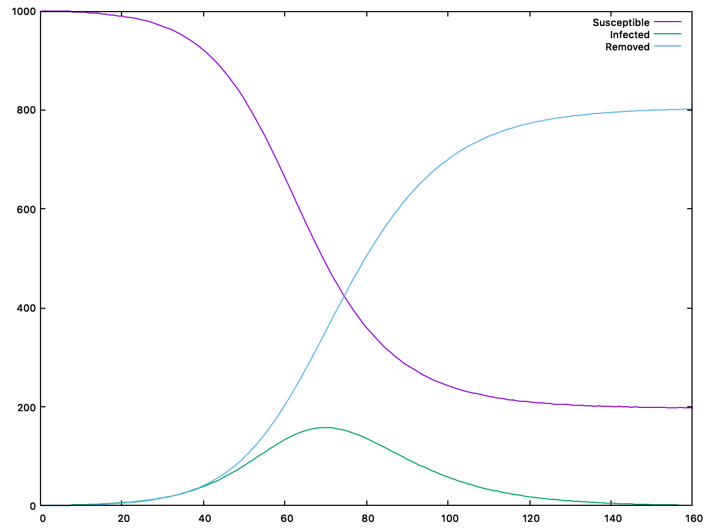
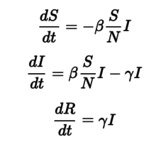

<p align="center">
  
</p>

# SIR-model-simulation
This is a very basic implementation of the [SIR model for virus spreading][1].
It lets you visualize how the three differential equations evolve over time, by
printing a table to the terminal. This is the first part of my coding exam
[final project][2] at University of Bologna, year one physics course.  
All the code in this project (excluding external libraries) is written entirely
by [me (Matteo Bonacini)][3].

[1]: https://en.wikipedia.org/wiki/Compartmental_models_in_epidemiology#The_SIR_model
[2]: https://baltig.infn.it/giaco/pf2020/-/blob/master/progetto/progetto.md
[3]: https://github.com/P2-718na

--------------------------------------------------------------------------------

## Dependencies
- [Lyra](https://github.com/bfgroup/Lyra) (bundled)
- [Doctest](https://github.com/onqtam/doctest) (bundled)
- [CMake](https://cmake.org/) (recommended)
- [gnuplot](http://www.gnuplot.info/) (optional)

## Building
The preferred way to compile this code is by using CMake.
```shell
mkdir build
cd build
cmake ..
```
Then, run either of these commands
```shell
make sir  # compile the program only
make tests    # compile tests only
make          # compile both
```
Both executables will be generated inside the build folder.

## Running
This code was tested and running on _Mac OS X 10.14.6 Mojave_ and
_Ubuntu 20.04 LTS (running on WSL)_.

### Running via terminal
The easiest way to learn how to use this program is to read the help message.
```
$ ./sir --help
USAGE:
  <executable> [-?|-h|--help] -b|--beta <beta> -c|--gamma <gamma> -s|--susceptible <susceptible> [-i|--infected <infected>] [-r|--removed <removed>] -t|--day-count <dayCount> [--pretty] [--no-headings]

Display usage information.

OPTIONS, ARGUMENTS:
  -?, -h, --help
  -b, --beta <beta>       Beta constant. Must be a number in range [0, 1].
  -c, -g, --gamma <gamma>     Gamma constant. Must be a number in range [0, 1].
  -s, --susceptible <susceptible>
                          Number of susceptible people.
  -i, --infected <infected>
                          Number of infected people. Defaults to 1.
  -r, --removed <removed> Number of removed people. Defaults to 0.
  -t, --day-count <dayCount>
                          Duration of the simulation.
  --pretty                Prints a pretty table to the terminal.
  --no-headings           Remove headings from normal print.Ignored if --pretty is added as well.
```
Example run with pretty-print option enabled:
```
$ ./sir -b 0.2 -c 0.1 -s 1000 -t 160 --pretty
┌-----┬-----┬-----┬-----┐
│  T  │  S  │  I  │  R  │
├-----┼-----┼-----┼-----┤
│    1| 1000│    1│    0│
├-----┼-----┼-----┼-----┤
│    2| 1000│    1│    0│
├-----┼-----┼-----┼-----┤
│    3| 1000│    1│    0│
├-----┼-----┼-----┼-----┤
≠≠≠≠≠≠≠≠≠≠≠≠≠≠≠≠≠≠≠≠≠≠≠≠≠
├-----┼-----┼-----┼-----┤
│  161|  198│    1│  802│
└-----┴-----┴-----┴-----┘
```
Example run with pretty-print option disabled:
```
$ ./sir -b 0.2 -c 0.1 -s 1000 -t 160 --no-headings
0 1000 1 0
1 1000 1 0
2 1000 1 0
3 1000 1 0
≠≠≠≠≠≠≠≠≠≠≠≠≠
160 198 1 802
```
Please note that the `≠` symbols mean that the output was truncated.  
The four columns represent the number of susceptible (S), infected (I) and
retired (R) people on each day (T) of the simulation. The initial state of the
simulation is printed as well, which means that the number of rows printed is
one more than the number specified using `--day-count`.

### Graphing data
If you have gnuplot installed, you can use it to display the data.
```shell
./sir -b 0.2 -c 0.1 -s 1000 -t 160 | (    \
  cat > /tmp/sir-data &&                  \
  trap 'rm /tmp/sir-data' EXIT &&         \
  gnuplot -p -e                               \
  "plot for [col=2:4] '/tmp/sir-data'     \
  using 0:col with lines title columnheader")
```
The previous command will display the following graph:

<p align="center">
  
</p>

If you are running on WSL 1, you might get this error:
```shell
gnuplot: error while loading shared libraries: libQt5Core.so.5: cannot open shared object file
```
It can be solved by running
```shell
sudo strip --remove-section=.note.ABI-tag /usr/lib/x86_64-linux-gnu/libQt5Core.so.5
```

### Testing
Make sure to [compile tests](#building), then run
```shell
./sir-tests
```

--------------------------------------------------------------------------------

## Components
What follows is a quick overview of the components that make up this program.
Additional information is present in the comments alongside the code.

### SIR Model
Class that handles the calculations of the SIR model. The model used consists
of three differential equations:

<p align="center">
  
</p>

Where `S`, `I` and `R` represent respectively the number of susceptible, infected and
removed (dead/vaccinated/recovered) people. The equations are solved
numerically, using an arbitrary value of `dS = 1 day`. The value of `S` is
computed using the constraint that `S + I + R` is constant throughout the
simulation.
`S`, `I` and `R` are handled internally as `double` types, but the respective
getter (or setter) functions will return (or accept) an integer value.
This was done because these three variables represent natural numbers, but decimal
numbers are required for solving the equations correctly.

### Visualizer
Class that handles the display of table data. Its constructor takes a reference
to a `Model` instance. The methods `visualize` and `visualizePretty` will run
the model for the specified number of days. Please note that the `Model` instance
will be altered by the visualizer.

### Parser
Class that handles the parsing of command line arguments and exposes getter
functions for them. The parsing is done using Lyra library (see dependencies).
The parser checks that the input format is correct.
The only value check performed here is for the `--day-count` parameter (if it is
negative, an error is shown). This is not strictly needed, but it can be helpful
to the user, since there are no explicit warnings for this anywhere else.  
All the needed value checks on parameters are performed inside the `Model` class
constructor.

### Tests
Unit Tests are performed using Doctest and are built separately from the main
executable. Tests are centered on the Model component, and they check that all
the constraints imposed by the model are met. For additional information on how  
to run tests, see [Testing](#testing).

--------------------------------------------------------------------------------

## Additional notes
1. A requirement of the project was that there must be no memory leaks or
illegal memory accesses. This program was run through Valgrind Memcheck
and is completely clean.
