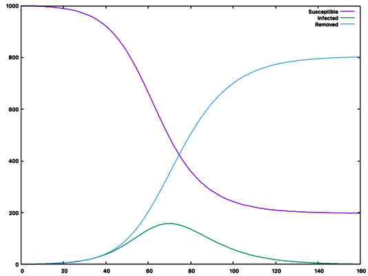

<p align="center">
  
</p>

# SIR-model-simulation
This is a very basic implementation of the [SIR model for virus spreading][1].
It lets you visualize how the three differential equations evolve over time, by
printing a table to the terminal.
This is the first part of my coding exam [final project][2] at University of
Bologna, year one physics course.
All the code in this project (excluding external libraries) is written entirely
by [me (Matteo Bonacini)][3].

[1]: https://en.wikipedia.org/wiki/Compartmental_models_in_epidemiology#The_SIR_model
[2]: https://baltig.infn.it/giaco/pf2020/-/blob/master/progetto/progetto.md
[3]: asd

--------------------------------------------------------------------------------

## Dependencies
- [Lyra](https://github.com/bfgroup/Lyra) (bundled)
- [Doctest](https://github.com/onqtam/doctest) (bundled)
- [Cmake](https://cmake.org/) (recommended)
- [gnuplot](http://www.gnuplot.info/) (optional)

## Compiling
The preferred way to build this code is by using Cmake.
```bash
mkdir build
cd build
cmake ..
```
Then, run
```bash
make sir-sym
```
to compile the program, or
```bash
make tests
```
to compile tests. Both executables will be generated inside the `src` folder
(inside your build folder).
//(TODO check tests)

## Running
### Running via terminal
The easiest way to learn how to use this program is to read the help message.
```
$ sir-sym --help
USAGE:
  <executable> [-?|-h|--help] -b|--beta <beta> -c|--gamma <gamma> -s|--susceptible <susceptible> [-i|--infected <infected>] [-r|--removed <removed>] -t|--day-count <dayCount> [--pretty]

Display usage information.

OPTIONS, ARGUMENTS:
  -?, -h, --help
  -b, --beta <beta>       Beta constant. Must be a number in range [0, 1].
  -c, --gamma <gamma>     Gamma constant. Must be a number in range [0, 1].
  -s, --susceptible <susceptible>
                          Number of susceptible people.
  -i, --infected <infected>
                          Number of infected people. Defaults to 1.
  -r, --removed <removed> Number of removed people. Defaults to 0.
  -t, --day-count <dayCount>
                          Duration of the simulation.
  --pretty                Prints a pretty table to the terminal.

```
Example run with pretty-print option enabled:
```
$ sir-sym -b 0.2 -c 0.1 -s 1000 -t 160 --pretty
┌-----┬-----┬-----┬-----┐
│  T  │  S  │  I  │  R  │
├-----┼-----┼-----┼-----┤
│    1| 1000│    1│    0│
├-----┼-----┼-----┼-----┤
│    2| 1000│    1│    0│
├-----┼-----┼-----┼-----┤
│    3| 1000│    1│    0│
├-----┼-----┼-----┼-----┤
≠≠≠≠≠≠≠≠≠≠≠≠≠≠≠≠≠≠≠≠≠≠≠≠≠≠
├-----┼-----┼-----┼-----┤
│  161|  198│    1│  802│
└-----┴-----┴-----┴-----┘
```
The four columns represent the number of susceptible (S), infected(I) and
retired (people) on each day (T) of the simulation. The initial state of the
simulation is printed as well, which means that the number of rows printed is
one more than the number specified using `--day-count`.

### Graphing data
If you have gnuplot installed, you can use it to display the data.
```bash
$ sir-sym -b 0.2 -c 0.1 -s 1000 -t 160 |  \
  gnuplot -p -e                           \
  "plot for [col=1:4] '<cat' using 0:col with lines title columnheader"
```
The previous command will display the following graph:


--------------------------------------------------------------------------------

## Components

### SIR Model
todo

### Visualizer
Handles the display of table data.

### Parser
todo

### Tests
todo

--------------------------------------------------------------------------------

## Additional notes
(todo, valgrind, etc)
